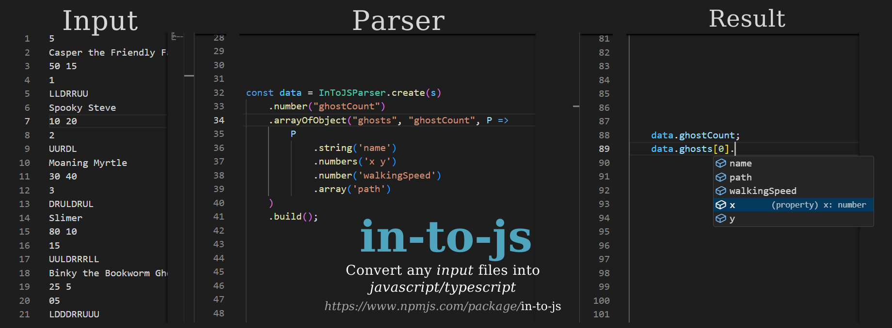

# in-to-js Parser

Convert any .in/.txt files into a javascript/typescript object. Ideal for low-level js developers who frequently work with files or coding contest participants.

<div align="center">


[](#)

</div>




## Features

 - ✅ Ready to use
 - ⚙ Typescript support
 - 🚀 No external libraries
 - 💡 Open for more. Request a feature in the issues tab.
 - 📝 MIT license 

## Install

```bash
# Via npm:
npm install in-to-js

# Via yarn:
yarn add in-to-js
```


## Usage
```jsx
import * as fs from 'fs';
import { InToJSParser } from 'in-to-js';

const s = fs.readFileSync('ghosts.in',{encoding: 'utf-8'}).split("\n");

const data = InToJSParser.create(s)
    .number("ghostCount")
    .arrayOfObject("ghosts", "ghostCount", P =>
        P
            .string('name')
            .numbers('x y')
            .number('walkingSpeed')
            .array('path')
    )
    .build();


/* Results:

    data.ghostCount = 5;
    data.ghosts = [{
            name: "Casper",
            x: 10,
            y: 2,
            walkingSpeed: 10,
            path: "UDLRUDL"
        },
        ...
    ];
*/

```

## Functions  

### Number
**number(name: string)**
Parses one number on that line

  
|Parser| Line .in file | Result |
|--|--| -- |
| `.number('n')` | 50  | `data.n = 50`


### Numbers
**numbers(names: string, splitBy = ' ')**
|Parser| Line .in file | Result |
|--|--| -- |
| `.number('x y')` | 7 13  | `data.x = 7, data.y = 13` 
| `.number('x/y', '/')` | 1/3  | `data.x = 1, data.y = 3` 

### Skip  
**skip(length: number | string = 1)**
|Parser| Line .in file | Result |
|--|--| -- |
| `.skip()` | ignore-me| Skips one line
| `.skip(3)` | ... | Skips multiple lines
| `.number('n').skip('n')` | ... | Skips `n` number of lines

### String
**string(name: string)**
|Parser| Line .in file | Result |
|--|--| -- |
| `.string('s')` | turn left  | `data.s = "turn left"`

### Array
**array(name: string, splitBy = '', mapFunc?: (x: string) => any)**
|Parser| Line .in file | Result |
|--|--| -- |
| `.array('arr')` | LRLRLLRDUU  | `data.arr = ['L', 'R', 'L', 'R', 'L', 'L', 'R', 'D', 'U', 'U']`
| `.array('arr', ' ', x => x*10)` | 1 2 3 4| `data.arr = [10, 20, 30, 40]`

### Lines
**lines(name: string, length: number | string, mapFunc?: (line: string) =>  any)**
|Parser| Lines .in file | Result |
|--|--| -- |
| `.lines('commands', 'n')` | LRL<br>DLR<br>DRU | `data.commands = ["LRL","DLR", "DRU"]`
| `.lines('commands', 2, line => line.toLowerCase())` | LRL<br>DLR<br>DRU | `data.commands = ["lrl","dlr"]`

#### Matrix
**matrix(name: string, length: number | string, splitBy = '', mapFunc?: (line: string) =>  any)**
|Parser| Lines .in file | Result |
|--|--| -- |
| `.matrix('matrix', 'n')` | 123<br>456<br>789 | `data.matrix = [[1,2,3], [4,5,6], [7,8,9]]`
| `.matrix('matrix', 'n', " ",  x => x*10)` | 1 2 3<br>4 5 6<br>7 8 9 | `data.matrix = [[10,20,30], [40,50,60], [70,80,90]]`

#### Array of objects
**arrayOfObject(name: string, length: number | string, p: (P: Parser) =>  any)**
|Parser| Lines .in file | Result |
|--|--| -- |
| `.arrayOfObject("ghosts", 'ghostCount', (P) =>`<br>`P`<br>`.numbers('x y')`<br>`.number("stepCount")`<br>`.array("path")`<br>`)` | 10 14<br>30<br> UUDULLRLLRRRDDUDDUUULLLUUDDRLR| `data.ghosts = [ {`<br>` x:10, y:14,`<br>`stepCount: 30,`<br>`path: ['U','U','D','U','L','L','R','L','L','R','R','R','D','D','U','D','D','U','U','U','L','L','L','U','U','D','D','R','L','R']  } ]`

## FAQ

❓ **Where can I find more examples?**  
💬 Use the link below: 
* [Tests folder](./src/__tests__/tests/)

❓ **What node versions does this package support?**  
💬 This project doesn't use external libraries or node functions. It uses only pure javascript, so it should work with any version. Let me know in the issues tab if you face any problems.

❓ **Are ideas welcome?**  
💬 We value all ideas, improvements, suggestions and pull requests ❤️.